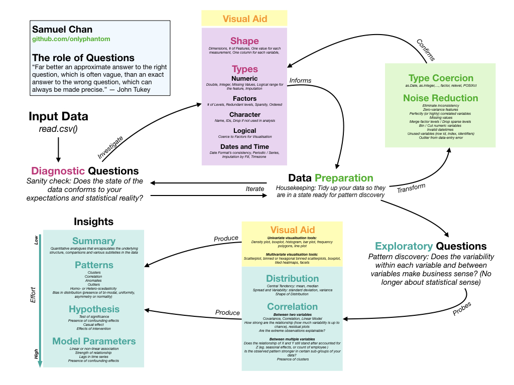

# Tactical Data Preparation

## Executive Summary
Tactical data science zooms in on the mental models behind common data preparation tasks, and aim to equip beginning practitioners with some practical advice on wrangling data in a productive manner. The 6 main takeaways are illustrated in both R and Python code, using a real world dataset. 

1. Favor a problem-solving style that is efficient and yields a **short feedback cycle**  
2. **Isolate contexts** by diagnosing your data before exploring it  
3. **Diagnostic questions** are sanity checks. They asks: "does the state of data conform to my expectations and statistical reality?"  
4. **Exploratory questions** are concerned with pattern discovery. They asks: "how can the information in the data be applied?"  
5. Incorporate **prior knowledge** and **domain knowledge** in your data preparation tasks  
6. Syntactic equivalence != Logical equivalence 

All example code are provided in R and Python, but only basic familiarity in both language is assumed. 

## Workshops
### Jakarta
- Date: 27 November 2019  
- Venue: Gedung Pusat Perfilman Usmar Ismail, Jl. H.R Rasuna Said  
- Delivery: English  

### Bali
- Date: 13 December 2019  
- Venue: Kembali Innovation Hub, Kuta  
- Delivery: English

## Badge of Completion
To earn a badge of completion, [attempt the quizzes](https://corgi.re/courses/onlyphantom/tacticaldataprep) on https://corgi.re. [Corgi](https://corgi.re) is an aggregation tool for **co**u**r**ses on **gi**thub (hence the name) with a primary focus on data science and computer programming. 

Link to earn a badge: [Tactical Data Preparation | Corgi](https://corgi.re/courses/onlyphantom/tacticaldataprep)